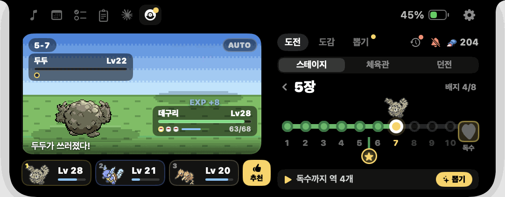
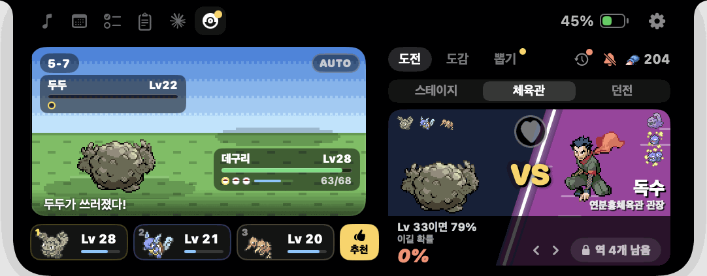
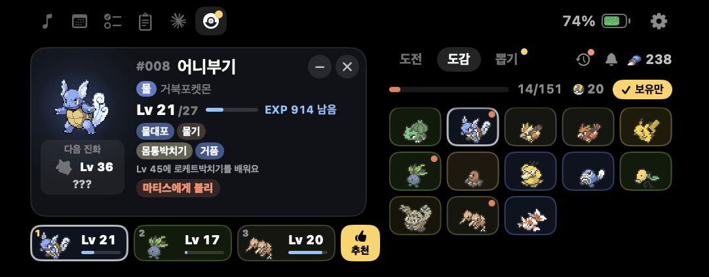
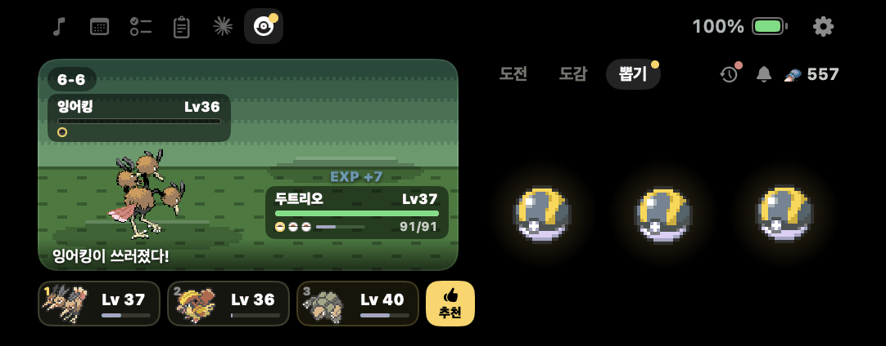
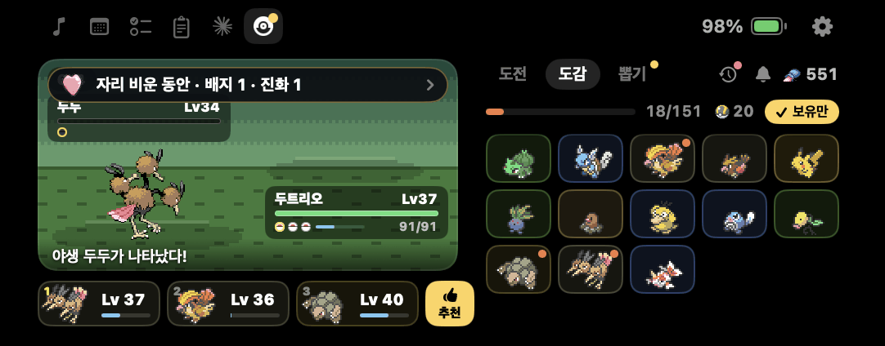
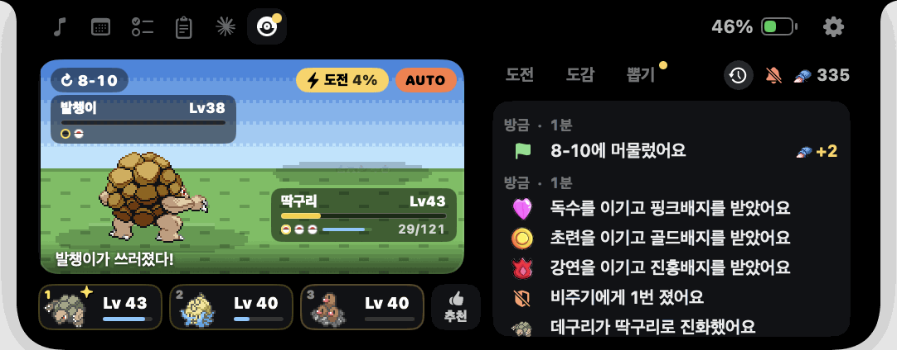

# pokove

[English](README.en.md) · [웹사이트](https://pokove.vercel.app) · [다운로드](https://github.com/geonhwiii/pokove/releases/latest)

에이전트가 일하는 동안 MacBook 노치 속 파티가 여행해요.

Claude Code나 Codex가 일하면 노치 안의 포켓몬 파티가 관동 지방을 한 역씩 지나가요. 노치에서 에이전트가 뭘 하는지 보고, Claude의 권한 요청에 앱을 바꾸지 않고 답할 수 있어요. 음악, 캘린더, 할 일, 클립보드도 노치에 있어요.



## 설치

1. [최신 릴리스](https://github.com/geonhwiii/pokove/releases/latest)에서 `pokove.dmg`를 받아 열어요.
2. pokove를 응용 프로그램 폴더로 끌어다 놓고 실행해요.

macOS 15 이상에서 돌아가요. 노치가 없는 화면에는 가상 노치가 생겨요. 새 버전이 나오면 노치의 톱니 아이콘에 점이 찍혀요. 설정 › 정보에서 누르면 앱 안에서 받아 설치하고 다시 켜져요. 1.2.4 이하에서는 새 버전을 한 번 직접 받아야 해요. 지우려면 설정 › 일반 › **pokove 제거**를 누르세요. Claude 훅과 로그인 항목을 없애고, 모험 저장·할 일·클립보드 기록·설정을 앱과 함께 휴지통으로 옮겨요.

## 포켓몬 모험

파티는 최대 세 마리예요. 에이전트가 일하는 동안에만 역을 지나가며 파이어레드·리프그린의 관동을 여행해요. 체육관과 포켓몬리그는 따로 도전해요.

- **시작:** 이상해씨, 파이리, 꼬부기 중 하나를 골라요 (Lv 5). 첫 뽑기 한 번은 공짜예요.
- **도전 탭**
  - **스테이지:** 관동을 30장으로 나눴고, 한 장은 역 10개짜리 노선이에요. 역마다 야생 포켓몬을 정해진 수만큼 이기면 다음 역으로 가요. 지금 역의 점을 둘러싼 링이 이길 때마다 차오르고, 다 차면 다음 역이에요. 새 역에 도착하면 별의모래 20, 장의 마지막 역을 깨면 100을 받아요. 야생 포켓몬은 파티 레벨에 맞춰 나와요. 마지막 역에는 세 마리가 나오고, 마지막 한 마리는 그 지역에서 가장 강한 보스예요. 보스는 파티 레벨과 상관없이 나와서, 체육관 앞 장으로 갈수록 강해져요. 이기면 다음 장으로 넘어가요. 지면 앞 역에서 몇 번 싸운 뒤 다시 도전하고, **다음 역**을 누르면 바로 도전해요. 28~30장은 챔피언이 된 뒤에 열려요. 역마다 그 지역의 실제 야생 포켓몬이 나와요. 지나온 역을 누르면 다시 돌 수 있어요.
  - **체육관:** 3장마다 체육관이 있어요. 3장을 다 지나면 웅, 6장을 지나면 이슬에게 도전할 수 있고, 27장을 지나면 사천왕과 챔피언이에요. VS 화면에 관장의 팀, 걸린 배지, 이길 확률, 필요한 레벨이 나와요. 도전은 직접 눌러서 시작해요.
  - **던전:** 별의모래 던전과 경험치 던전이 있어요. 1단계는 Lv 2 한 마리, 2단계는 두 마리라서 스타터 한 마리로도 시작할 수 있어요. 3단계부터는 세 마리가 나오고 마지막 한 마리가 보스예요. 단계마다 두 레벨씩 올라가요.
    - 던전마다 하루 세 번 도전할 수 있어요. 새 단계를 깨면 횟수를 돌려받고, 지면 한 번이 줄어요. 막히면 남은 횟수로 가장 높이 깬 단계를 다시 깨서 보상을 받아요. 횟수는 오전 4시에 채워져요.
    - 별의모래 던전은 요일마다 타입이 바뀌고, 10단계마다 처음 깰 때 울트라볼을 줘요. 경험치 던전은 노말·페어리 타입이 나오고, 파티 셋에게 경험치를 줘요.
  - **타워:** 챔피언이 된 뒤에 열리는 배틀타워예요. 지기 전까지 한 층씩 올라가고 최고 기록이 남아요.
  - 체육관, 전설, 던전, 타워는 에이전트가 쉬어도 시작하면 끝까지 싸워요. 져도 잃는 건 없어요.
- **아래 줄:** 도전 탭 아래 한 줄이 지금 할 일을 알려줘요. 체육관까지 남은 역, 이기려면 필요한 레벨, 바로가기(던전, 뽑기) 같은 것이요.
- **배지를 받으면 레벨 상한이 올라요.** 상한을 넘은 경험치는 쌓아 뒀다가 다음 배지 때 들어와요.
- **전설:** 노선의 ★ 갈림길에 잠만보, 썬더, 프리져, 파이어가 있고, 챔피언 뒤에는 뮤츠가 있어요. 이기면 동료가 돼요.
- **배틀:** 게임처럼 1:1로 교대하며 싸워요. 기술마다 주먹, 번개, 빔, 지진처럼 다른 연출이 나와요. 3세대 기술의 위력과 명중, 급소, 연속기, 흡수와 반동이 그대로고, 독·화상·마비도 걸려요. 경험치는 파티 셋이 똑같이 받아요.



### 포켓몬 모으기

포켓몬을 얻다가 실패하는 일은 없어요.

- **발견:** 에이전트가 20분쯤 일할 때마다 그 지역 포켓몬이 바로 동료가 돼요. 이미 있는 계열이면 경험치로 바뀌어요.
- **뽑기:** 별의모래 400으로 몬스터볼 세 개 중 하나를 열어요. 이미 있는 계열이면 경험치를 줘요. 처음부터 진화 전 포켓몬은 모두 나와요. 다른 스타터, 이브이, 화석, 라프라스도 나와요. 뽑은 포켓몬은 파티보다 1~3레벨 낮게 와요. 진화형은 키워서 진화시키고, 전설은 ★ 전설에게 이겨야 동료가 돼요. 챔피언이 된 뒤에는 뮤가 아주 드물게 나와요.
- **이로치:** 발견과 뽑기에서 1/128 확률로 나와요. 이미 있는 계열이 이로치로 나오면 가진 포켓몬이 그 레벨 그대로 이로치가 돼요.
- **도감 보상:** 10종을 모을 때마다 울트라볼을 하나 줘요.



포켓몬 카드에는 다음 진화, 다음에 배울 기술, 다음 레벨까지 남은 경험치, 레벨 상한, 다음 보스와의 상성이 나와요. 아직 없는 포켓몬은 어떻게 얻는지 보여줘요. 파티 칸은 끌어서 순서를 바꾸고, 도감에서 포켓몬을 끌어다 놓으면 교체돼요. 파티 옆 **자동**을 누르면 다음 상대에 맞는 세 마리로 바로 바뀌어요.



### 자리 비운 동안

페이지를 닫아 둔 동안 배지, 새 체육관, 진화, 새 동료, 보스 패배 같은 큰일이 있었다면 다시 열 때 배틀 위에 한 줄로 잠깐 알려줘요. 전부 **기록**(종 옆 시계)에 오늘과 어제 것까지 남아요.





배너는 새 포켓몬, 진화, 배지, 전설처럼 큰일에만 떠요. 화면을 공유하기 전에는 페이지의 종이나 메뉴 막대 메뉴의 **모험 알림**으로 한 번에 끌 수 있어요.

> 비공식·비상업 팬 기능이에요. Nintendo, Game Freak, Creatures Inc., The Pokémon Company와 관계가 없고 승인받지 않았어요. 포켓몬과 관련 이름, 캐릭터, 이미지는 모두 해당 회사의 상표이자 저작물이에요.

## 에이전트


**설정할 게 없어요.** pokove는 에이전트가 일하면서 남기는 세션 파일을 따라가요. `~/.claude/projects`는 Claude 데스크톱 앱, CLI, IDE 확장을, `~/.codex/sessions`는 Codex 앱과 CLI를 다뤄요.

- 일하는 동안 닫힌 노치에 Claude·Codex 마크와 선두 포켓몬, 경과 시간이 보여요.
- 끝나거나, 권한이나 입력이 필요하거나, 실패하면 노치에서 배너가 내려와요. 누르면 그 세션의 앱으로 가요.
- 노치를 열면 에이전트 페이지에 지금 일하는 세션과 기다리는 요청만 보여요.

**권한 요청에 노치에서 답하기:** 설정 › Claude Code에서 **훅 설치**를 누르세요.

- `~/.claude/settings.json`에 작은 훅을 더해요. 다른 설정과 훅은 그대로 두고, 원래 파일은 `settings.json.pokove-backup`으로 남겨요.
- 훅은 `curl`로 `127.0.0.1:47821`에 이벤트를 보내고, pokove가 꺼져 있으면 아무것도 하지 않아요.
- 이미 돌고 있는 Claude Code 세션은 다시 시작해야 훅을 읽어요.
- Claude가 돌아가는 앱(터미널, iTerm, VS Code, Claude 데스크톱…)이 앞에 없으면 노치에 허용 / 거부가 떠요. 45초 안에 답하지 않거나 그 앱으로 가면 Claude가 원래대로 물어봐요.

## 노치의 다른 기능

- **지금 재생 중:** 앨범 아트, 재생 위치, 이전 / 재생 / 다음, 출력 기기 선택. 곡이 바뀌면 노치가 잠깐 한 줄 늘어나요. AirPods나 스피커가 연결되면 배터리 카드가 내려와요.
- **캘린더와 할 일:** 오늘 일정과 달력 옆에 할 일 목록이 있어요.
- **클립보드:** 복사한 텍스트, 링크, 색, 이미지, 파일을 최신순으로 보여줘요. 누르면 다시 복사하고, 앞에 있는 앱에 바로 붙여 넣을 수도 있어요. 비밀번호 관리자가 표시한 복사본은 저장하지 않아요.
- **HUD:** 볼륨과 밝기 표시를 노치로 바꿔요. 배터리가 20%, 10%, 5%일 때 알려줘요.
- **제스처:** 트랙패드로 아래로 쓸면 열리고, 열린 상태에서는 페이지를 넘겨요. 위로 쓸면 닫혀요. 옆으로 쓸면 곡을 넘겨요.
- **화면:** 내장 화면이나 모든 화면에 노치를 띄울 수 있어요. 전체 화면일 때 숨기거나, 화면 녹화에서 빼는 것도 돼요.

노치는 작업 중인 앱에서 키보드 포커스를 가져가지 않아요. 할 일을 입력할 때만 잠깐 빌려 쓰고 돌려줘요.

## 권한

| 기능 | 권한 |
|---|---|
| 볼륨 / 밝기 HUD 바꾸기 | 손쉬운 사용 (설정 › 디스플레이 및 사운드 › 허용…) |
| 클립보드 기록에서 붙여 넣기 | 손쉬운 사용 (pokove가 ⌘V를 대신 눌러요). 없으면 복사만 돼요 |
| 캘린더 페이지 | 캘린더 (처음 열 때 물어봐요) |
| 지금 재생 중 | 필요 없어요. `/usr/bin/perl`에 올린 작은 브리지가 MediaRemote를 읽어요 |

pokove는 하루에 한 번 사이트의 업데이트 목록(`appcast.xml`)만 확인해요. 앱 버전 말고는 이 Mac에 대한 정보를 보내지 않아요. 설정 › 정보에서 끌 수 있어요.

pokove의 예전 이름은 dancove예요. 처음 실행할 때 dancove의 설정과 `~/Library/Application Support/dancove/`(세이브, 할 일, 클립보드 기록)를 복사해 오고 원본은 그대로 둬요. macOS는 새 앱으로 보기 때문에 손쉬운 사용과 캘린더 권한, 로그인 시 실행은 다시 켜 주세요.

## 데이터

- 포켓몬 종, 파이어레드·리프그린 기술(상태이상 확률 포함), 야생 출현 정보는 [PokéAPI](https://pokeapi.co) GraphQL 요청 세 번으로 받아요.
- 스프라이트는 PokéAPI 스프라이트 저장소(7세대 아이콘, 블랙·화이트 움직이는 스프라이트와 이로치, 아이템, 배지)에서, 체육관 관장은 [Pokémon Showdown](https://play.pokemonshowdown.com/sprites/trainers/)에서 받아요.
- 모두 실행 중에 받아서 `~/Library/Application Support/pokove/pokemon/`에 저장해요. **앱과 코드에는 포켓몬 에셋이 들어 있지 않아요.** 이 README의 스크린샷만 예외예요.
- 세이브는 `adventure-v3.json`(Debug 빌드는 `adventure-v3-debug.json`)이에요.

## 개발

Xcode 27에서 `pokove.xcodeproj`를 열고 실행하거나:

```bash
xcodebuild -project pokove.xcodeproj -scheme pokove -configuration Release -derivedDataPath build/DerivedData build
```

- `scripts/install.sh`는 Release로 빌드해서 `~/Applications`에 설치하고 다시 실행해요.
- `scripts/package.sh [notes.md]`는 릴리스용 `build/pokove.dmg`(직접 받는 용)와 `build/pokove.zip`(앱 안 업데이트용)을 만들고 `gh release create` 명령을 알려줘요. 릴리스 노트를 넘기면 `scripts/appcast.py`가 zip에 서명해서 `site/public/appcast.xml`에 새 버전을 더해요. 릴리스를 올린 뒤 appcast를 푸시하면, 설치된 앱이 앱 안에서 업데이트해요.
  - 서명 키는 이 Mac의 로그인 키체인에 있어요(Sparkle `generate_keys`). 앱에는 공개키만 `Config/Info.plist`에 들어가요. 키를 잃으면 설치된 앱이 새 업데이트를 받지 못하니, `generate_keys -x <파일>`로 내보내서 안전한 곳에 백업해 두세요.
- `scripts/adventure-sim.swift`는 게임 규칙을 수백 시간 돌려서 진행 속도를 맞춰요. 규칙과 조정 기록은 [`docs/pokemon-handoff.md`](docs/pokemon-handoff.md)에 있어요.
- `swift scripts/make-icon.swift`는 앱 아이콘(노을 진 바닷가를 그린 44칸 픽셀 아트)을 다시 그려요.

**번역:** 앱은 시스템 언어를 따르고 영어와 한국어를 지원해요. 설정 › 일반 › 언어에서 바꿀 수 있어요. 문구는 `pokove/Localizable.xcstrings`에 있어요. UI 문구를 더했다면:

```bash
xcrun xcstringstool sync pokove/Localizable.xcstrings --stringsdata $(find build/DerivedData/Build/Intermediates.noindex/pokove.build -name '*.stringsdata' -path '*Debug*')
python3 scripts/localize-ko.py   # 한국어를 채우고, 번역이 없는 키를 알려줘요
```

**웹사이트:** `site/`는 [Astro](https://astro.build)로 만든 랜딩 페이지예요. https://pokove.vercel.app 에 한국어(`/`)와 영어(`/en/`)로 올라가 있고, `main`에 푸시할 때마다 Vercel이 배포해요.

```bash
cd site && pnpm install && pnpm dev   # http://localhost:4321
```

**디버그:** Debug 빌드는 `com.geonhwiii.pokove.debug` 알림으로 조작할 수 있어요. 명령 목록은 [README.en.md › Building](README.en.md#building)에 있어요.

## 로고

Claude 마크는 [Simple Icons](https://simpleicons.org)의 공식 로고 경로(`claude.svg`)를, Codex 마크는 Codex 앱 아이콘을 벡터로 다시 그린 것을 써요. 두 로고는 각 회사의 상표예요.
